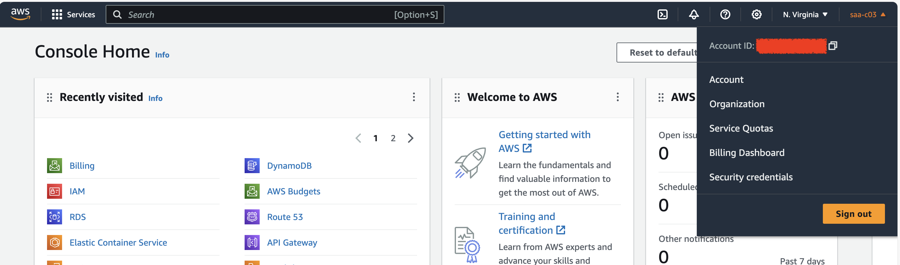
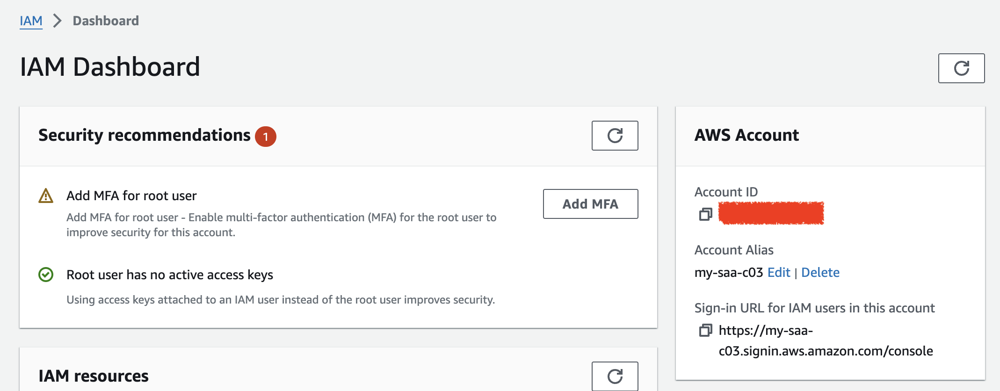

# Lab-00

## Accounts Setup

Difficulty Level: 1

Creation Date: November 20, 2023

Author: [Thyago Mota](https://github.com/thyagomota)

## Goal

To create and configure an AWS Free Tier account and a users with administrator privilege. You will also install AWS's command line interface (CLI) and configure access to AWS through CLI. 

## AWS Free Tier Account 

To create an AWS Free Tier account, go to [Sign up for AWS](https://portal.aws.amazon.com/billing/signup#/start/email). You will need: 

* an email that hasn't been registered to an AWS account before,  
* to choose an account name, 
* a phone number, and 
* a credit card. 

The email address used is referred to as the **Root user email address**. Make sure you keep this account's password secure. To configure this account click on the top-right drop-down menu with the account's name (see below). 



Under **Account**, you can change the account's name, contact information associated with the account, and other configurations. One setting you might want to activate is **IAM user/role access to billing information**. Also, under **Preferences - Billing Preferences**, activate **PDF invoices delivery by email** and set an email to receive **AWS Free Tier alerts**. 

It is recommended to create a billing alert to avoid surprise bills. That can be done under **Cost Management - Budgets**. Create a budget to receive notifications when the bill goes over a pre-defined amount. 

## User w/ Administrator Privilege 

Create a new user under IAM (Identity and Access Management). Under **IAM Dashboard** you can create an **Account Alias**. Note that the account alias has to be unique and it is used in the sign-in url. 



Go to **Access management - Users groups**. Create a new group called **admin** and attach the **AdministratorAccess** policy. Then go to **Users** and create create a new user in the **admin** group. 

After the user is created, click on the **Security credentials** tab. 


There, scroll down to **Access keys** and click on **create access key**. 

## CLI Access to AWS

Download AWS command line interface from [https://aws.amazon.com/cli/](https://aws.amazon.com/cli/). Open a terminal and configure access using: 

```
aws configure
```

When prompted, enter your access key id and secret. Test your access using: 

```
aws s3 ls
```

Nothing will be displayed but you should not get an error. 