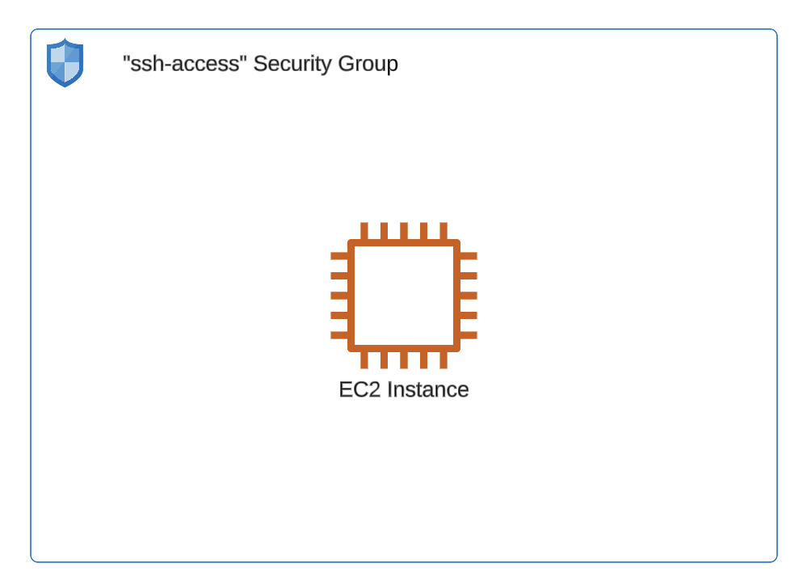
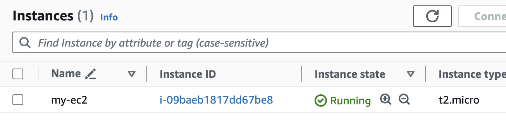
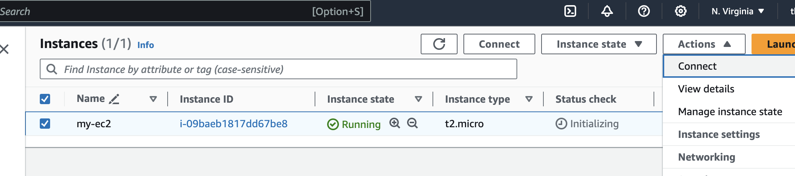
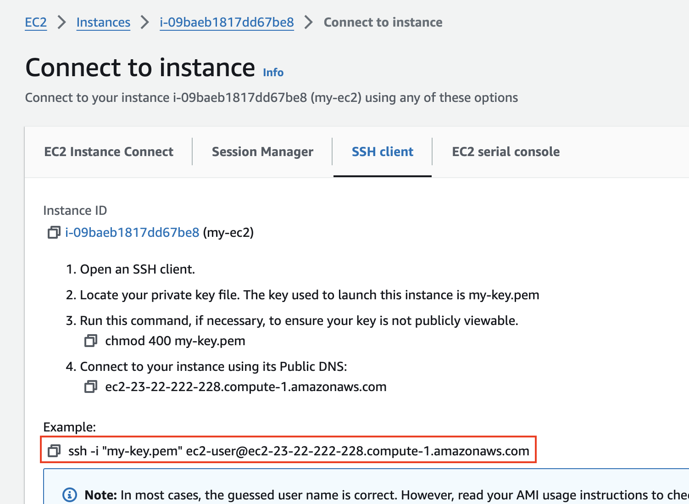
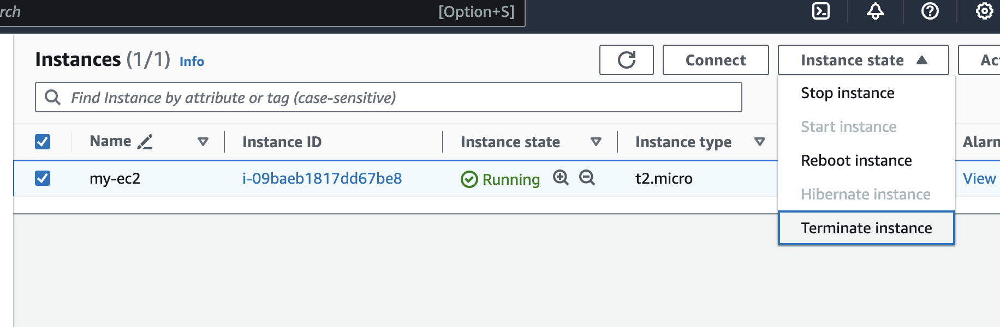
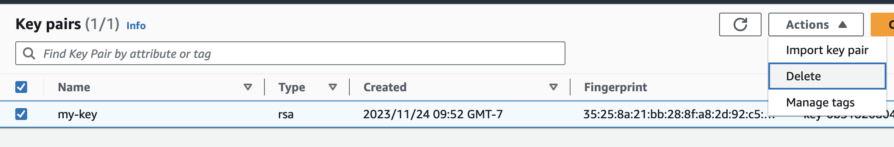

# Lab-01

## Accounts Setup

Difficulty Level: 1

Creation Date: November 24, 2023

Author: [Thyago Mota](https://github.com/thyagomota)

## Goal

To launch a single EC2 instance in a public subnet accessible over the Internet via SSH. 

## Architecture Diagram



## Steps 

Go to AWS Console and login with your credentials and search for EC2. 

### Step 1 

Click on **Launch instance**. Fill the information in each section using the following parameters: 

* Name and tags
    * Name: my-ec2
* Application and OS Images (Amazon Machine Image)
    * Quick Start: Amazon Linux (default)
    * Amazon Machine Image: Amazon Linux 2023 AMI (default)
    * Architecture: 64-bit (x86) (default)
* Instance type
    * Instance type: t2.micro (default)
* Key pair (login)
    * Key pair name (required): my-key (click on the **Create new key pair** link and use the defaults options)
* Network settings
    * Firewall (security groups): Create security group (default)
    * Allow SSH traffic from: Anywhere (default)
* Configuration storage
    * 1 x 8 Gib gp3 (default)

When you are ready, click on **Launch instance**. Go to **EC2 - Instances** and wait until your instance state change to **Running**.

Note that the access key is associated with the account that was used to create the EC2 instance. 



### Step 2

This step describes how to connect to your EC2 instance using SSH. You need to open a terminal window and change the current folder to your **download** folder. There you should be able to have access to the **my-key.pem** file that was automatically downloaded during the EC2 instance configuration. Change the permissions to the pem file using: 

```
chmod 600 my-key.pem
```

Next, on the AWS web console, select your instance and click on the drow-down **Actions** menu. Click on **Connect**. 



Copy the SSH command line and run it on your terminal. 



You should be able to login to your EC2 instance, like shown in the example below. 

```
% ssh -i "my-key.pem" ec2-user@ec2-23-22-222-228.compute-1.amazonaws.com
The authenticity of host 'ec2-23-22-222-228.compute-1.amazonaws.com (23.22.222.228)' can't be established.
ED25519 key fingerprint is SHA256:IdFCWoBzkSTN1RZRKNIphhW0iTSp6anP3VYoxiTrEG0.
This key is not known by any other names
Are you sure you want to continue connecting (yes/no/[fingerprint])? yes
Warning: Permanently added 'ec2-23-22-222-228.compute-1.amazonaws.com' (ED25519) to the list of known hosts.
   ,     #_
   ~\_  ####_        Amazon Linux 2023
  ~~  \_#####\
  ~~     \###|
  ~~       \#/ ___   https://aws.amazon.com/linux/amazon-linux-2023
   ~~       V~' '->
    ~~~         /
      ~~._.   _/
         _/ _/
       _/m/'
[ec2-user@ip-172-31-23-78 ~]$ 
```

Type **exit** and **enter** when you are done. 

### Step 3

Select your instance and click on the drop-down **Instance state** menu. Next, select **Terminate instance**. 



Optionally, you can delete the key that was created by selecting the **Network & Security - Key Pairs**. Select the key and then **Actions - Delete**. 

